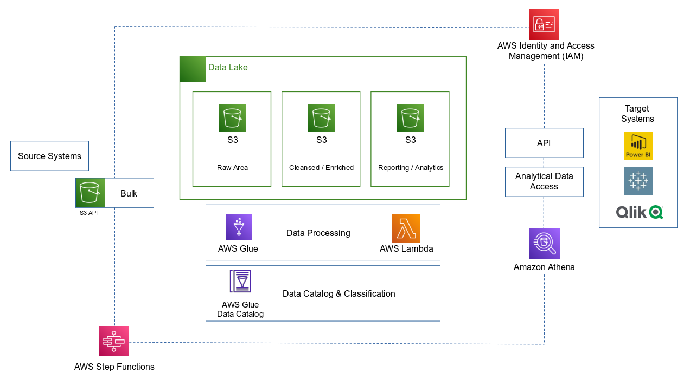
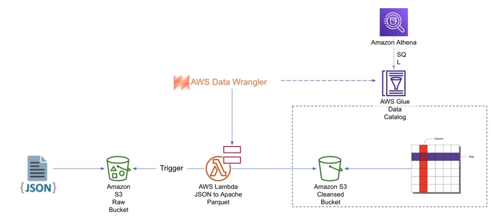
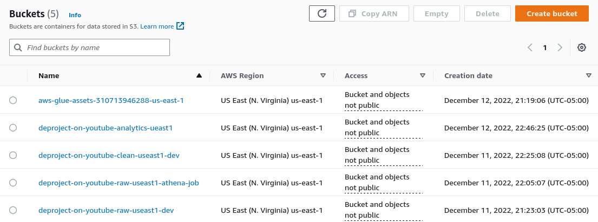
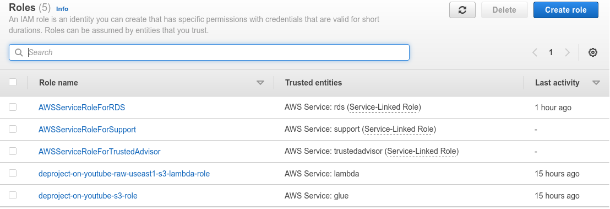
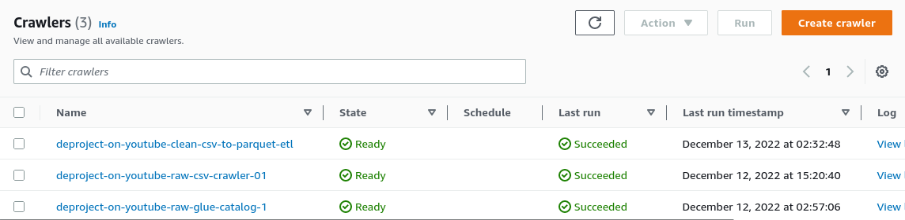
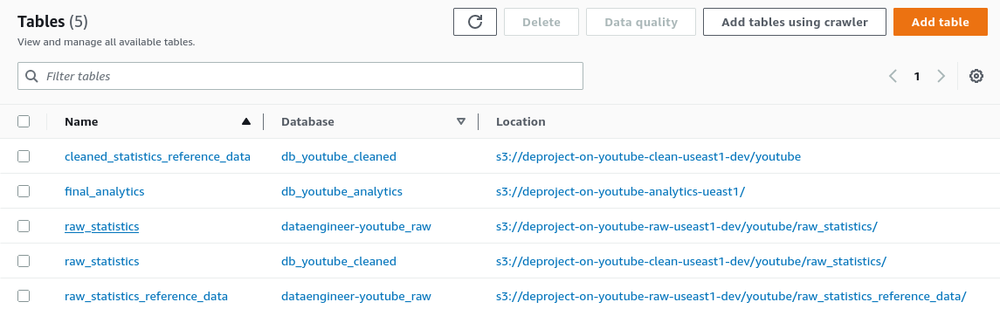
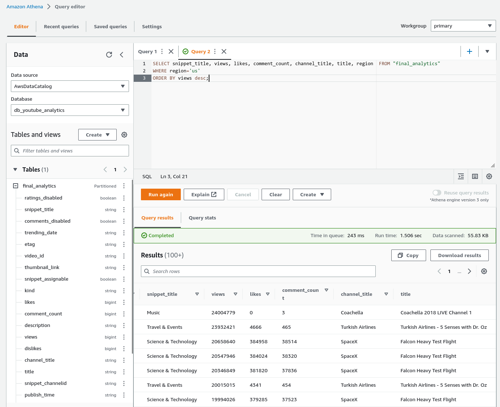

# DataEngineering-YouTube-Trending-Project


# Table of Contents 
1. [Introduction](README.md#introduction)
2. [Project Architecture](README.md#project-architecture)
3. [Requirements](README.md#requirements)
4. [Environment Set Up](README.md#environment-setup)
5. [Repository Structure](README.md#repository-structure)
6. [Steps](README.md#steps)
7. [Figures](README.md#figures)
<!-- 8. [References](README.md#references) -->

# Introduction
**End-to-End Data Engineering Project using Kaggle YouTube Trending Dataset**

This is a data engineering project simulating a request from a customer launching a new data-driven campaign with the main advertising channel: YouTube.

The goal of this project is to help our Analytics team answer the following questions:

1. How do we categorize videos based on their comments and statistics?
2. What factors affect how popular a YouTube video will be?

## Goals and Success Criteria
**How will my customer measure success?**

- Data Ingestion - Ingest data, one-offs and incrementally
- Data Lake - Design and build a new Data Lake architecture
- AWS Cloud - AWS as the cloud provider
- ETL Design - Extract, transform and load data efficiently
- Scalability - The data architecture should scale efficiently
- Reporting - Build a Business Intelligence tier, including Dashboards (In Progress)

## In this project, I demonstrate how to:

1. Build a data lake from scratch in AWS S3 (joining semi-structured and structured data).
2. Design lake house architecture while implementing best practices (cost and performance).
3. Design data lake in layers, partitioned for cost-performance (e.g., landing, cleansed as SSOT, reporting for BI users, WORM (Write Once Ready Many)
4. Perform ETL in AWS Glue using Spark jobs, Amazon SNS for alerting, SQL using Amazon Athena and Spark SQL (i.e., impact of querying the optimized data layers).
5. Ingest changes incrementally and manage schema evolution.
6. *Connect to BI dashboards. (To be continued)*

## About our dataset
- Top trending videos on YouTube
    - What is "Trending"?: YouTube uses factors, including users interactions (e.g., number of views, shares, comments and likes). Not the most-viewed videos overall per calendar year.
- Source: 
    - [Kaggle](https://www.kaggle.com/datasets/datasnaek/youtube-new)
    - Data collected using [Trending YouTube Scraper](https://github.com/mitchelljy/Trending-YouTube-Scraper) 


# Project Architecture



## __Cleansed / Enriched  vs. Reporting / Analytics Layer__
The reason for building the Reporting / Analytics layer is to avoid joining large complex queries. We can combine data in the ETL pipeline and just give the final version of the table to the Data Analyst or Data Scientist. This makes things easier to quickly analyze the data and build machine learning models.

Using Cleansed Layer
```
SELECT ref.snipper_title, stats.title, stats.title
FROM raw_statstics stats
    INNER JOIN cleansed_statistics_reference_data ref on (stats.category_id = ref.id)
WHERE ref.id=2;
```

Using Reporting Layer
```
SELECT snippet_title, title, title
FROM rpt_youtube_statistics_categories
WHERE id=2;
```

## Data Cleansing - Semi-structured to Structured data



# Requirements

**Languages** 
* Bash
* Python 3.8
* Pandas

**Technologies**
* Spark 3.1
* AWS Athena
* AWS Glue 3.0 - Supports spark 3.1, Scala 2, Python 3
* AWS Lambda
* AWS Identity and Access Management (IAM)

**Third-Party Libraries**
* AWS CLI

# Environment Setup
1. Install and configure [AWS CLI](https://aws.amazon.com/cli/)
2. Steps to get our data
    1. Download from [Kaggle](https://www.kaggle.com/datasets/datasnaek/youtube-new)
    2. Create an Amazon S3 bucket, for our landing bucket
        - Use naming convention:
            - s3://company-raw-awsregion-awsaccountID-env/source/source_region
                - env = dev, test, prod
                - source = name or indicator of source
                - source_region = region of data source
        - In our case, the bucket name is: **deproject-on-youtube-raw-useast1-dev/**
3. Copy the data to S3, using our [AWS S3 CLI commands](bash/s3_cli_command.sh)


# Repository Structure

`./athena/` contains SQL for viewing tables on Athena

`./bash/` contains the CLI commands to copy files to S3 bucket

`./data/` contains raw data from kaggle and sample output data from Athena

`./glue/` contains the spark scripts to launch spark jobs using Glue

`./lambda/` contains py scripts for the ETL job in Lambda

`./static/` contains images used for this project

# Steps

1. Create [IAM user](https://docs.aws.amazon.com/IAM/latest/UserGuide/id_users_create.html) account
2. Install [AWS CLI](https://aws.amazon.com/cli/) (See [Environment Set Up](README.md#Environment%20Setup) above)
3. Create S3 Bucket (Raw Area) and upload data using [CLI commands](bash/s3_cli_command.sh)
4. Build [Glue Crawler](https://docs.aws.amazon.com/glue/latest/ug/tutorial-add-crawler.html) and Catalog for json data (unstructured)
    - s3://deproject-on-youtube-raw-useast1-dev/youtube/raw_statistics_reference_data/
5. Use Athena and [SQL](athena/test_query.sql) to query data
6. Solve any errors during preprocessing
7. Configure desired schema changes in Glue console
8. Write ETL job in [Lambda](lambda/lambda_function.py), and clean data    
    - Set target to cleansed S3 bucket (Cleansed / Enriched)
    - Add trigger to this function so that this runs when a new object is added to the landing S3 bucket (Raw)
9. Query clean data on Athena
10. Repeat steps 5 to 9, but for csv data (structured)
    - s3://deproject-on-youtube-raw-useast1-dev/youtube/raw_statistics/region=ca/
11. Join unstructured data and structured data using [glue join script](glue/join_script.py)
    - This will create a table (final_analytics) in the Data Catalog and on subsequent runs, update the schema and add new partitions
    - Set target to analytics S3 bucket (Reporting / Analytics)
12. Use Athena and [SQL](athena/final_query.sql) to query final_analytics table
13. *Connect to BI Tool of choice for visualizing data (To be continued)*

# Figures

## Figure 1.0 - S3 Buckets <br />


## Figure 2.0 - IAM Roles <br />


## Figure 3.0 - Glue Crawlers <br />


## Figure 3.1 - Glue Tables <br />


## Figure 4.0 - Athena - Final Query <br />
